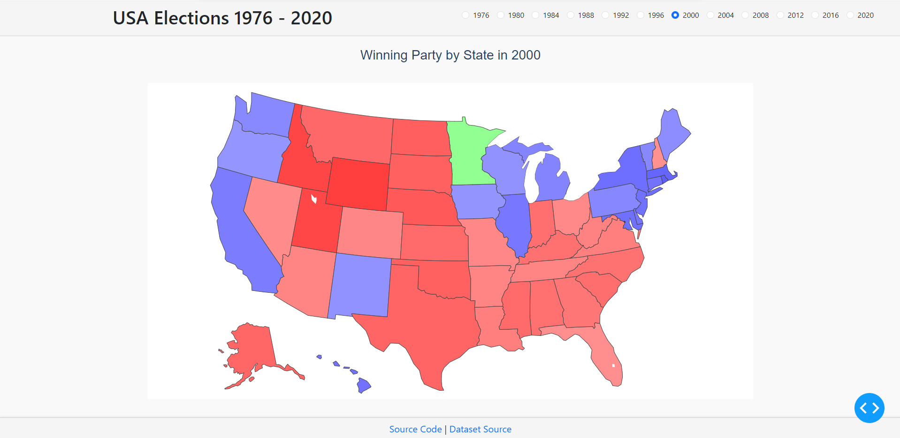

## Overview
This Dash application visualizes U.S. election data from 1976 to 2020, allowing users to visualize the winning party in each state through an interactive map.

 

## Features
- **Interactive Choropleth Map**: Displays the winning party by state for the selected year.
- **Year Selector**: Radio buttons allow users to select the election year.

## File Structure
- **app.py**: The main application file that initializes the Dash app and defines the layout and callbacks.
- **components.py**: Contains custom components such as the footer and radio items.
- **utils.py**: Utility functions including the get_color function used for color coding the map.
- **data/**: Directory containing the election data CSV file.

## Installation
1. Clone the repository:
```bash
git clone https://github.com/Alfredomg7/usa-elections-dashboard.git
cd elections-visualization-app
```
2. Install the required dependencies:
```bash
pip install -r requirements.txt
```
3. Prepare the data:
- Place your election data CSV file in the data directory. Ensure the file is named elections_data.csv and follows the expected structure.

4. Run the application:
```bash
python app.py
```
5. View the app:
- Open your web browser and go to http://127.0.0.1:8050/.

## Data Source
The election data used in this application is sourced from [Plotly Figure Friday week 33 repository ](https://github.com/plotly/Figure-Friday/tree/main/2024/week-33).
